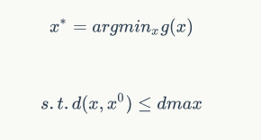
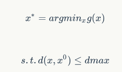
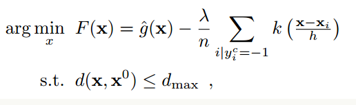

---
title:Evasion attacks against machine learning at test time

Welcome to Yonah's Blog

# Evasion attacks against machine learning at test time

## 作者
>  Battista Biggio,   Igino Corona, Davide Maiorca, Blaine Nelson, Nedim Srndic, Pavel Laskov, Giorgio Giacinto, Fabio Roli

## 简介
> **文章分为四个部分：**
>- 提出对抗样本的问题；   
>- 提出基于梯度下降的对抗样本生成方法；   
>- 将提出的方法应用到手写数字识别任务并扩展 到恶意PDF识别任务；   
>- 总结归纳部分

> **为什么要做对抗攻击的研究?**   
总所周知，如今机器学习可以运用到很多安全的问题，于此同时机器学习算法的安全性就显得越来越重要，因此这种学习系统的设计者应该更加积极主动地参与并阻止这种不良的对抗样本的影响。通俗来说，就是说要主动研究对抗攻击，从中找到能让模型更加稳定鲁棒的方法。
   
      
> **对抗性学习的三个步骤：**   
> - 在攻击者部署对抗样本之前找到学习模型的潜在攻击点 
> - 探索调研对应攻击对算法模型的不良影响 
> - 如果影响比较大，就需要设计合适的对应措施（也就是设计defence策略）

 ## **Optimal evasion at test time**   
 1. 攻击者的目标应该是最大化或者最小化某个损失函数。在evasion背景下，这个目标就是操纵单个样本，让它被分类器误识别。

2. 为了构建一个对抗样本，首先需要决定采取的策略。如果通过操作输入数据，让一个恶意样本刚刚越过决策边界，这种对抗样本就可以通过轻微调整决策边界被轻易识别出来。更好的策略是攻击者构造的对抗样本会以更高的置信度被误识别，也就是最小化分类器的输出概率的值。

3. 接下来是对抗攻击者的knowledge分析，攻击者能力（攻击方式的分析）

    - 攻击者能拥有的关于攻击目标的知识包括：（能否以这个为自变量进行探究各个因素的影响呢？）    
        - 训练集   
        - 每个样本的特征表示   
        - 学习算法的种类和决策函数的形式   
        - 分类模型（比如一个线性分类器的权重信息）   
        - 来自分类模型的反馈（也就是将对抗样本作为输入后，攻击者能否得到分类模型的分类结果）   
    - 攻击者的攻击方式包括： 
        - 修改输入数据   
        - 修改特征向量   
        - 只修改某一些特定的特征（因为某些情况下的输入数据可能是相互依赖的）  
4. 过去的研究认为对抗者可以任意修改输入数据，构造对抗样本。但实际上这些都是有限制的，并且在实际应用场景下，这些限制会更加严格。

5. 接下来讨论两种情况下的攻击场景：

    - 攻击者具有Perfect Knowledge(特征空间，分类器类别，训练模型等等都知道的情况下)
    - Limited Knowledge：不知道学习好的分类器和训练数据，因此不能直接计算g(x)，这个g（x）指的是分类器的损失函数。但是，这种情况下，会假设对抗样本可以能够收集到替代的数据集，这些数据集和真实数据集具有同样的分布，都是从一个更大的数据集中采样得到。   
    【因为对抗攻击希望用替代数据得到的映射函数和真实模型具有尽量相同的特征，因此在训练过程中，如果真实模型的输出能够得到，那么可以利用这个输出来训练替代模型。】
6. 构建对抗攻击的问题，就是一个非线性的优化问题，对于这类问题通常有gradient descent, or quadratic techniques such as Newton’s method, BFGS, or L-BFGS等方法。

7. **攻击策略**    
文中提出的攻击方法的核心思想是，找到一个目标恶意样本，优化过程就是找到一个样本，最小化g()和，并且这个样本和目标恶意样本的差别不能太大，也就是下面这个公式：

而这是一个非线性的优化问题。要优化这个问题，可以使用的方法有：gradient descent, Newton’s method, BFGS, 或者 L-BFGS。   
##  **Algorithm**     
接下来介绍本文中用到的梯度下降法（gradient descent）： 
首先，根据上文提到的，优化目标函数是 

但是在实际应用中，由于分类器目标函数的特性，这个函数可能不是凸函数，因此局部优化可能会造成攻击的失败。因此，当传统的梯度下降方法得到了一些对抗样本时，攻击者对于这个样本是否能躲开分类器的识别，是没有信心的。因此，为了增加攻击成功的可能性，提高优化效率，论文提出了一个新的目标优化问题，即是攻击者构造的攻击点应该尽可能地集中在合法输入点附近，也就是正样本密度比较大的区域。因此，给目标函数引入了一个新的成分——用一个密度估计器来预测p(x|y=-1)。加入了这个部分，可以让算法构建出来的对抗样本模仿已知的正样本的特征（也就是在特征空间上与已经有的合法的输入尽可能类似）。这个密度估计器，文中称之为kernel density estimators（KDE）。

对应的公式表示如下： 

算法的整个过程可以概括为交替地优化（最小化） g^(x)和最大化估计密度p(x|yc = −1)；

论文后面对算法的讲解，就是根据上述公式，在g(x)不同的情况下进行梯度下降的推导。g(x)针对不同的机器学习模型具有不同的形式，比如线性分类模型、支持向量机模型、神经网络模型。以及对KDE梯度的推导。