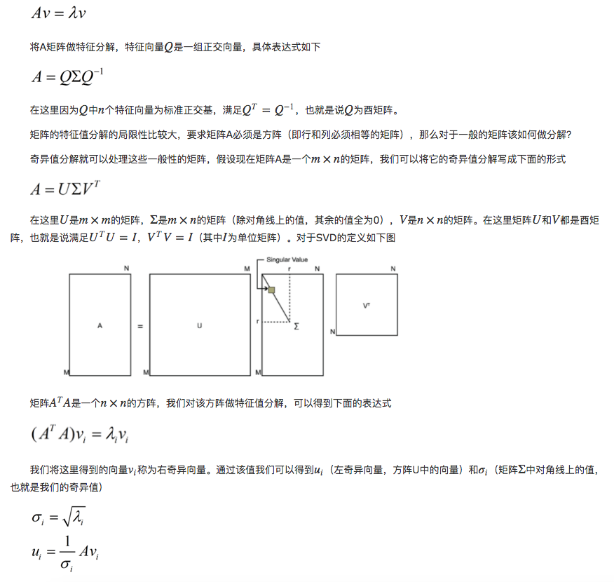
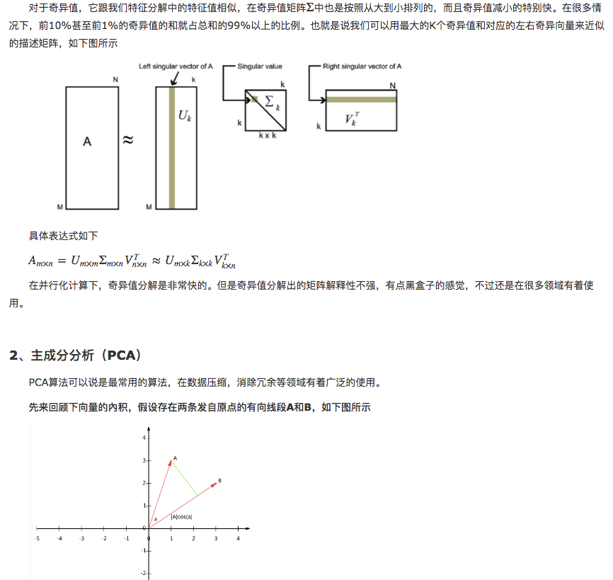
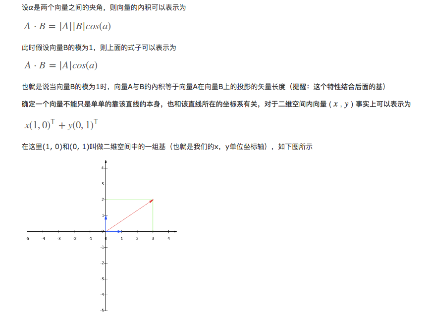
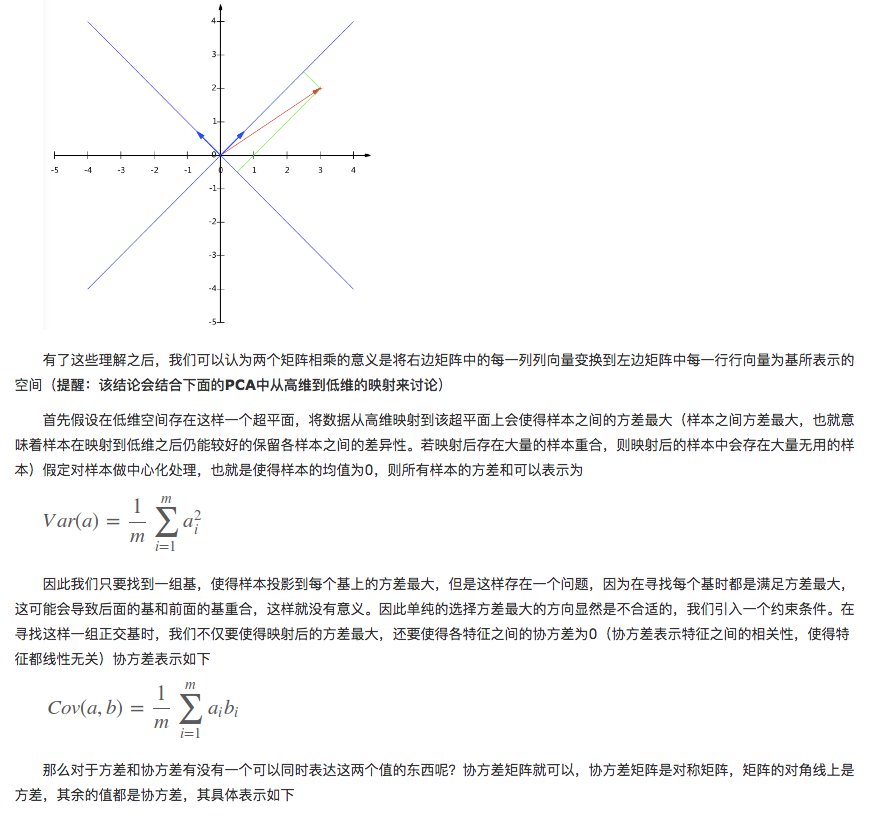
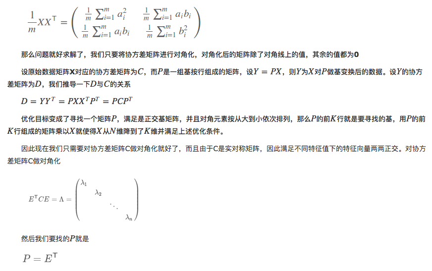
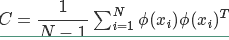

## 简介
降维方法有很多，而且分为线性降维和非线性降维，本篇文章主要讲解线性降维。   
降维是机器学习中很重要的一种思想。在机器学习中经常会碰到一些高维的数据集，而在高维数据情形下会出现数据样本稀疏，距离计算等困难，这类问题是所有机器学习方法共同面临的严重问题，称之为“ 维度灾难 ”。另外在高维特征中容易出现特征之间的线性相关，这也就意味着有的特征是冗余存在的。基于这些问题，降维思想就出现了。

　　
## 奇异值分解（SVD）
为什么先介绍SVD算法，因为在后面的PCA算法的实现用到了SVD算法。SVD算法不光可以用于降维算法中的特征分解，还可以用于推荐系统，以及自然语言处理等领域。是很多机器学习算法的基石。

　　在线性代数中我们学过矩阵（在这里的矩阵必须是n×n的方阵）的特征分解，矩阵A和特征值、特征向量之间的关系如下

事实上对于一条直线我们可以选择任意两个线性无关的单位向量（选择单位向量是因为便于计算，参考上面的提醒）来表示它的基，如下图所示我们用两条单位对角线作为基（在这里我们选择的基是正交的，因为正交基具有较好的性质，因此一般都选择正交基）

得到P之后就可以直接求得我们降维后的矩阵Y=PX（注意：这里对于矩阵X做左乘是会压缩行的，也就是矩阵Y的行数要少于矩阵X，因此原始矩阵X是n∗m，其中n是特征数，m是样本数）。这就是整个PCA的简单理解流程

　　事实上在数据量很大时，求协方差矩阵，然后在进行特征分解是一个很慢的过程，因此在PCA背后的实现也是借助奇异值分解来做的，在这里我们只要求得奇异值分解中的左奇异向量或右奇异向量中的一个（具体求哪个是要根据你的X向量的书写方式的，即行数是样本数还是特征数，总之左奇异向量是用来压缩行数，右奇异向量是用来压缩列数，而我们的目的是要压缩特征数）

　　在我们的PCA转换中是一个线性转换，因此也被称为线性降维。但有时数据不是线性的，无法用线性降维获得好的结果，那么这里就引入了我们的核PCA方法来处理这些问题，具体表达式如下

只需要在求协方差矩阵时，将数据先映射到高维（根据低维不可分的数据在高维必定可分的原理），然后再对这高维的数据进行PCA降维处理，为了减少计算量，像支持向量机中那样用核函数来处理求内积的问题。这类方法就是核主成分分析方法（KPCA），KPCA由于要做核运算，因此计算量比PCA大很多。